# 🚀 GUIAS DE DESARROLLO MTZ OUROBORUS AI v3.0

**Documento oficial de estándares y mejores prácticas**
_Fecha de creación: 2025-01-27_

---

## 📋 **TABLA DE CONTENIDOS**

1. [🎯 Metodología de Desarrollo](#-metodología-de-desarrollo)
2. [🏗️ Arquitectura del Proyecto](#️-arquitectura-del-proyecto)
3. [📁 Estructura de Archivos](#-estructura-de-archivos)
4. [🔧 Configuración y Setup](#-configuración-y-setup)
5. [💻 Estándares de Código](#-estándares-de-código)
6. [🎨 Patrones de UI/UX](#-patrones-de-uiux)
7. [🔐 Autenticación y Seguridad](#-autenticación-y-seguridad)
8. [📊 Manejo de Datos](#-manejo-de-datos)
9. [🧪 Testing y Calidad](#-testing-y-calidad)
10. [🚀 Deploy y Producción](#-deploy-y-producción)

---

## 🎯 **METODOLOGÍA DE DESARROLLO**

### **Principios Fundamentales**

1. **🧠 Componentes Reutilizables**: Todo componente debe ser diseñado para reutilización
2. **📱 Mobile-First**: Desarrollo responsive desde móvil hacia desktop
3. **⚡ Performance First**: Optimización constante de rendimiento
4. **🔒 Security by Design**: Seguridad integrada desde el diseño
5. **📖 Documentación Clara**: Código autodocumentado y comentarios útiles

### **Flujo de Trabajo**

```mermaid
graph TD
    A[Análisis de Requerimientos] --> B[Diseño de Componentes]
    B --> C[Desarrollo con TDD]
    C --> D[Testing y QA]
    D --> E[Code Review]
    E --> F[Deploy a Staging]
    F --> G[Deploy a Producción]
```



---

## 🏗️ **ARQUITECTURA DEL PROYECTO**

### **Stack Tecnológico**

```javascript
// Frontend
React 18.2.0 + Vite
Tailwind CSS + Radix UI
React Router v6
Zustand (Estado Global)
React Hook Form + Zod

// Backend
Supabase (PostgreSQL)
Row Level Security (RLS)
Supabase Auth
Supabase Storage

// Deploy
Vercel (CI/CD)
GitHub Actions
```

### **Patrón de Arquitectura**

```
src/
├── components/          # Componentes reutilizables
│   ├── ui/             # Componentes base (Button, Input, etc.)
│   ├── layout/         # Layout principal
│   ├── auth/           # Componentes de autenticación
│   ├── [module]/       # Componentes específicos por módulo
│   └── shared/         # Componentes compartidos
├── pages/              # Páginas principales
├── hooks/              # Custom hooks
├── contexts/           # Context providers
├── lib/                # Configuraciones y servicios
├── utils/              # Utilidades y constantes
├── store/              # Estado global (Zustand)
└── types/              # Tipos TypeScript
```

---

## 📁 **ESTRUCTURA DE ARCHIVOS**

### **Convenciones de Nomenclatura**

```javascript
// Archivos de componentes
ComponentName.jsx; // PascalCase
component - name.module.css; // kebab-case para CSS modules

// Archivos de utilidades
helpers.js; // camelCase
constants.js; // camelCase
validation.js; // camelCase

// Archivos de configuración
config.js; // camelCase
vite.config.js; // kebab-case
tailwind.config.js; // kebab-case
```

### **Organización de Imports**

```javascript
// 1. Imports de React y librerías externas
import React, { useState, useEffect } from 'react';
import { useNavigate } from 'react-router-dom';

// 2. Imports de componentes UI
import Button from '@/components/ui/Button';
import Input from '@/components/ui/Input';

// 3. Imports de hooks personalizados
import useAuth from '@/hooks/useAuth';
import usePermissions from '@/hooks/usePermissions';

// 4. Imports de utilidades
import { formatCurrency, validateEmail } from '@/utils/helpers';
import { COMPANY, UI } from '@/utils/constants';

// 5. Imports de servicios
import { supabase } from '@/lib/supabase';
import { ClientesService } from '@/lib/dataService';

// 6. Imports de estilos
import './ComponentName.css';
```

---

## 🔧 **CONFIGURACIÓN Y SETUP**

### **Variables de Entorno**

```bash
# .env.local
VITE_SUPABASE_URL=tu_supabase_url
VITE_SUPABASE_ANON_KEY=tu_supabase_anon_key
VITE_GA_TRACKING_ID=tu_ga_tracking_id
```

### **Scripts Disponibles**

```json
{
  "dev": "vite", // Desarrollo local
  "build": "vite build", // Build de producción
  "preview": "vite preview", // Preview del build
  "lint": "eslint . --ext js,jsx", // Linter
  "format": "prettier --write", // Formateador
  "test": "vitest", // Tests
  "test:ui": "vitest --ui", // Tests con UI
  "test:coverage": "vitest run --coverage" // Cobertura
}
```

---

## 💻 **ESTÁNDARES DE CÓDIGO**

### **Reglas de ESLint**

```javascript
// ✅ CORRECTO
const Component = ({ prop1, prop2 }) => {
  const [state, setState] = useState(null);

  useEffect(() => {
    // Lógica del efecto
  }, []);

  return <div>{prop1}</div>;
};

// ❌ INCORRECTO
const component = props => {
  const [state, setState] = useState(null);

  useEffect(() => {
    // Lógica del efecto
  }); // Sin dependencias

  return <div>{props.prop1}</div>;
};
```

### **Patrones de Componentes**

```javascript
// Componente funcional con hooks
const ComponentName = ({ prop1, prop2, children }) => {
  // 1. Estados
  const [loading, setLoading] = useState(false);
  const [error, setError] = useState(null);

  // 2. Hooks personalizados
  const { user } = useAuth();

  // 3. Efectos
  useEffect(() => {
    if (prop1) {
      handleDataLoad();
    }
  }, [prop1]);

  // 4. Funciones
  const handleDataLoad = async () => {
    try {
      setLoading(true);
      setError(null);
      // Lógica
    } catch (err) {
      setError(err.message);
    } finally {
      setLoading(false);
    }
  };

  // 5. Renderizado condicional
  if (loading) return <LoadingSpinner />;
  if (error) return <ErrorMessage error={error} />;

  // 6. JSX
  return <div className='component-name'>{children}</div>;
};

// PropTypes o TypeScript
ComponentName.propTypes = {
  prop1: PropTypes.string.isRequired,
  prop2: PropTypes.number,
  children: PropTypes.node,
};

export default ComponentName;
```

### **Patrones de Hooks**

```javascript
// Hook personalizado
const useCustomHook = param => {
  const [state, setState] = useState(null);
  const [loading, setLoading] = useState(false);
  const [error, setError] = useState(null);

  const fetchData = useCallback(async () => {
    try {
      setLoading(true);
      setError(null);
      // Lógica
      setState(data);
    } catch (err) {
      setError(err.message);
    } finally {
      setLoading(false);
    }
  }, [param]);

  useEffect(() => {
    fetchData();
  }, [fetchData]);

  return { state, loading, error, refetch: fetchData };
};
```

---

## 🎨 **PATRONES DE UI/UX**

### **Sistema de Diseño**

```javascript
// Colores del sistema
const colors = {
  primary: '#3B82F6', // Azul principal
  secondary: '#6B7280', // Gris secundario
  success: '#10B981', // Verde éxito
  warning: '#F59E0B', // Amarillo advertencia
  error: '#EF4444', // Rojo error
  info: '#06B6D4', // Azul info
};

// Espaciado
const spacing = {
  xs: '0.25rem', // 4px
  sm: '0.5rem', // 8px
  md: '1rem', // 16px
  lg: '1.5rem', // 24px
  xl: '2rem', // 32px
  '2xl': '3rem', // 48px
};
```

### **Componentes Base**

```javascript
// Button Component
const Button = ({
  variant = 'primary',
  size = 'md',
  loading = false,
  disabled = false,
  children,
  ...props
}) => {
  const baseClasses =
    'inline-flex items-center justify-center font-medium rounded-lg transition-colors focus:outline-none focus:ring-2 focus:ring-offset-2';

  const variants = {
    primary: 'bg-blue-600 text-white hover:bg-blue-700 focus:ring-blue-500',
    secondary: 'bg-gray-600 text-white hover:bg-gray-700 focus:ring-gray-500',
    success: 'bg-green-600 text-white hover:bg-green-700 focus:ring-green-500',
    danger: 'bg-red-600 text-white hover:bg-red-700 focus:ring-red-500',
  };

  const sizes = {
    sm: 'px-3 py-1.5 text-sm',
    md: 'px-4 py-2 text-sm',
    lg: 'px-6 py-3 text-base',
  };

  return (
    <button
      className={`${baseClasses} ${variants[variant]} ${sizes[size]}`}
      disabled={disabled || loading}
      {...props}
    >
      {loading && <Spinner className='mr-2' />}
      {children}
    </button>
  );
};
```

### **Responsive Design**

```javascript
// Breakpoints
const breakpoints = {
  mobile: '640px',
  tablet: '768px',
  desktop: '1024px',
  wide: '1280px',
};

// Clases responsive
const responsiveClasses = {
  grid: 'grid-cols-1 md:grid-cols-2 lg:grid-cols-3 xl:grid-cols-4',
  text: 'text-sm md:text-base lg:text-lg',
  spacing: 'p-4 md:p-6 lg:p-8',
};
```

---

## 🔐 **AUTENTICACIÓN Y SEGURIDAD**

### **Patrón de Autenticación**

```javascript
// AuthContext
const AuthContext = createContext();

export const AuthProvider = ({ children }) => {
  const [user, setUser] = useState(null);
  const [loading, setLoading] = useState(true);
  const [initialized, setInitialized] = useState(false);

  useEffect(() => {
    if (initialized) return;

    const initializeAuth = async () => {
      try {
        const {
          data: { session },
        } = await supabase.auth.getSession();
        setUser(session?.user || null);
      } catch (error) {
        console.error('Error inicializando auth:', error);
      } finally {
        setLoading(false);
        setInitialized(true);
      }
    };

    initializeAuth();
  }, [initialized]);

  const signIn = async (email, password) => {
    try {
      const { data, error } = await supabase.auth.signInWithPassword({
        email,
        password,
      });

      if (error) throw error;

      setUser(data.user);
      return { success: true };
    } catch (error) {
      return { success: false, error: error.message };
    }
  };

  const signOut = async () => {
    await supabase.auth.signOut();
    setUser(null);
  };

  return (
    <AuthContext.Provider
      value={{
        user,
        loading,
        signIn,
        signOut,
        isAuthenticated: !!user,
      }}
    >
      {children}
    </AuthContext.Provider>
  );
};
```

### **Protección de Rutas**

```javascript
// ProtectedRoute Component
const ProtectedRoute = ({ children, requiredRole = null }) => {
  const { user, loading, isAuthenticated } = useAuth();
  const navigate = useNavigate();

  useEffect(() => {
    if (!loading && !isAuthenticated) {
      navigate('/login', { replace: true });
    }
  }, [loading, isAuthenticated, navigate]);

  if (loading) return <LoadingSpinner />;
  if (!isAuthenticated) return null;

  // Verificar rol si es necesario
  if (requiredRole && user?.role !== requiredRole) {
    return <AccessDenied />;
  }

  return children;
};
```

---

## 📊 **MANEJO DE DATOS**

### **Patrón de Servicios**

```javascript
// DataService Pattern
export class ClientesService {
  static async getClientes(filters = {}) {
    try {
      let query = supabase.from('empresas').select('*');

      // Aplicar filtros
      if (filters.search) {
        query = query.or(
          `nombre.ilike.%${filters.search}%,rut.ilike.%${filters.search}%`
        );
      }

      if (filters.estado) {
        query = query.eq('estado', filters.estado);
      }

      const { data, error } = await query.order('nombre');

      if (error) throw error;

      return { success: true, data };
    } catch (error) {
      return { success: false, error: error.message };
    }
  }

  static async createCliente(clienteData) {
    try {
      const { data, error } = await supabase
        .from('empresas')
        .insert([clienteData])
        .select()
        .single();

      if (error) throw error;

      return { success: true, data };
    } catch (error) {
      return { success: false, error: error.message };
    }
  }
}
```

### **Patrón de Estado Global**

```javascript
// Zustand Store
import { create } from 'zustand';
import { persist } from 'zustand/middleware';

const useClientesStore = create(
  persist(
    (set, get) => ({
      // Estado
      clientes: [],
      loading: false,
      error: null,
      filters: {},

      // Acciones
      setClientes: clientes => set({ clientes }),
      setLoading: loading => set({ loading }),
      setError: error => set({ error }),
      setFilters: filters => set({ filters }),

      // Acciones asíncronas
      fetchClientes: async (filters = {}) => {
        set({ loading: true, error: null });

        try {
          const result = await ClientesService.getClientes(filters);

          if (result.success) {
            set({ clientes: result.data, loading: false });
          } else {
            set({ error: result.error, loading: false });
          }
        } catch (error) {
          set({ error: error.message, loading: false });
        }
      },
    }),
    {
      name: 'clientes-storage',
      partialize: state => ({
        clientes: state.clientes,
        filters: state.filters,
      }),
    }
  )
);
```

---

## 🧪 **TESTING Y CALIDAD**

### **Estructura de Tests**

```javascript
// Component Test
import { render, screen, fireEvent } from '@testing-library/react';
import { BrowserRouter } from 'react-router-dom';
import ClientesPage from '@/pages/Clientes/ClientesPage';

const renderWithRouter = component => {
  return render(<BrowserRouter>{component}</BrowserRouter>);
};

describe('ClientesPage', () => {
  test('renderiza correctamente', () => {
    renderWithRouter(<ClientesPage />);
    expect(screen.getByText('Gestión de Clientes')).toBeInTheDocument();
  });

  test('muestra loading inicial', () => {
    renderWithRouter(<ClientesPage />);
    expect(screen.getByTestId('loading-spinner')).toBeInTheDocument();
  });

  test('maneja errores correctamente', async () => {
    // Mock del servicio para simular error
    jest
      .spyOn(ClientesService, 'getClientes')
      .mockRejectedValue(new Error('Error de conexión'));

    renderWithRouter(<ClientesPage />);

    await screen.findByText('Error de conexión');
  });
});
```

### **Cobertura de Tests**

```bash
# Ejecutar tests con cobertura
npm run test:coverage

# Cobertura mínima requerida
- Statements: 80%
- Branches: 70%
- Functions: 80%
- Lines: 80%
```

---

## 🚀 **DEPLOY Y PRODUCCIÓN**

### **Configuración de Vercel**

```json
// vercel.json
{
  "buildCommand": "npm run build",
  "outputDirectory": "dist",
  "framework": "vite",
  "rewrites": [
    {
      "source": "/(.*)",
      "destination": "/index.html"
    }
  ],
  "headers": [
    {
      "source": "/static/(.*)",
      "headers": [
        {
          "key": "Cache-Control",
          "value": "public, max-age=31536000, immutable"
        }
      ]
    }
  ]
}
```

### **Variables de Entorno de Producción**

```bash
# Vercel Environment Variables
VITE_SUPABASE_URL=tu_supabase_url_produccion
VITE_SUPABASE_ANON_KEY=tu_supabase_anon_key_produccion
VITE_GA_TRACKING_ID=tu_ga_tracking_id_produccion
```

### **Monitoreo y Analytics**

```javascript
// Analytics Setup
import { Analytics } from '@vercel/analytics/react';

function App() {
  return (
    <>
      <Analytics />
      {/* Resto de la aplicación */}
    </>
  );
}
```

---

## 📋 **CHECKLIST DE DESARROLLO**

### **Antes de Commit**

- [ ] ✅ Código formateado con Prettier
- [ ] ✅ Linter sin errores
- [ ] ✅ Tests pasando
- [ ] ✅ Cobertura de tests mínima alcanzada
- [ ] ✅ Documentación actualizada
- [ ] ✅ Responsive design verificado
- [ ] ✅ Accesibilidad verificada
- [ ] ✅ Performance optimizada

### **Antes de Deploy**

- [ ] ✅ Variables de entorno configuradas
- [ ] ✅ Build exitoso
- [ ] ✅ Tests de integración pasando
- [ ] ✅ Revisión de código completada
- [ ] ✅ Documentación de cambios actualizada

---

## 🆘 **SOLUCIÓN DE PROBLEMAS**

### **Problemas Comunes**

1. **Error de importación con alias @/**

   ```bash
   # Verificar vite.config.js
   resolve: {
     alias: {
       '@': path.resolve(__dirname, './src'),
     },
   }
   ```

2. **Error de autenticación**

   ```javascript
   // Verificar variables de entorno
   console.log('Supabase URL:', import.meta.env.VITE_SUPABASE_URL);
   console.log('Supabase Key:', import.meta.env.VITE_SUPABASE_ANON_KEY);
   ```

3. **Error de build**
   ```bash
   # Limpiar cache
   rm -rf node_modules/.vite
   npm run build
   ```

### **Comandos Útiles**

```bash
# Desarrollo
npm run dev

# Build
npm run build

# Preview
npm run preview

# Linting
npm run lint

# Formateo
npm run format

# Tests
npm run test

# Tests con UI
npm run test:ui
```

---

## 📞 **CONTACTO Y SOPORTE**

- **Desarrollador Principal**: Claude AI
- **Empresa**: MTZ Consultores Tributarios
- **Email**: mtzcontabilidad@gmail.com
- **Sistema**: MTZ Ouroborus AI v3.0

---

**🎯 Este documento es la fuente de verdad para el desarrollo del sistema MTZ**

_Última actualización: 2025-01-27_
